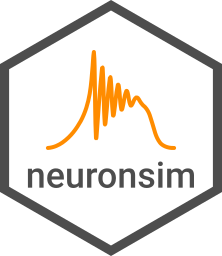

```{r, include = FALSE}
knitr::opts_chunk$set(
  collapse = TRUE,
  comment = "#>",
  fig.path = "man/figures/README-"
)
```
# neuronsim <!--  -->

<!-- badges: start -->
<!-- [](https://cran.r-project.org/package=<package>) -->
`r badgecreatr::badge_lifecycle("experimental")`
<!-- [](https://github.com/aldomann/<package>/actions) -->
<!-- [](https://codecov.io/gh/aldomann/<package>?branch=master) -->
<!-- [](https://aldomann.github.io/<package>/) -->
<!-- badges: end -->

## Overview

The goal of `{neuronsim}` is to simulate the dynamics of neuronal ensembles using the model of FREs and QIF neurons.

## Installation

<!-- You can install the released version of neuronsim from [CRAN](https://CRAN.R-project.org) with: -->

<!-- ``` r -->
<!-- install.packages("neuronsim") -->
<!-- ``` -->

<!-- And  -->
The development version can be installed from [GitHub](https://github.com/) with:

``` r
# install.packages("devtools")
devtools::install_github("aldomann/neuronsim")
```

## Examples
