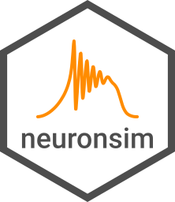

```{r, include = FALSE}
knitr::opts_chunk$set(
  collapse = TRUE,
  comment = "#>",
  fig.path = "man/figures/README-"
)

knitr::opts_chunk$set(fig.align = "center")
ggplot2::theme_set(ggplot2::theme_bw())
```

# neuronsim 

<!-- badges: start -->
[](https://cran.r-project.org/package=neuronsim)
`r badgecreatr::badge_lifecycle("maturing")`
<!-- [](https://github.com/aldomann/<package>/actions) -->
<!-- [](https://codecov.io/gh/aldomann/<package>?branch=master) -->
<!-- [](https://aldomann.github.io/<package>/) -->
<!-- badges: end -->

## Overview

The goal of `{neuronsim}` is to simulate the dynamics of neuronal ensembles using the model of FREs and QIF neurons.

## Installation

<!-- You can install the released version of neuronsim from [CRAN](https://CRAN.R-project.org) with: -->

<!-- ``` r -->
<!-- install.packages("neuronsim") -->
<!-- ``` -->

<!-- And  -->
The development version can be installed from [GitHub](https://github.com/) with:

``` r
# install.packages("devtools")
devtools::install_github("aldomann/neuronsim")
```

## Examples

```{r}
library(neuronsim)

init_state <- c(r = 0, v = -2)
params <- c(delta = 1, etabar = -5, J = 15)
times_seq <- seq(from = -10, to = 40, by = 0.001)
current <- constant_input(t, current = 3, t_start = 0, t_end = 30)
```

The macroscopic dynamics of neuronal ensembles can be described by solving the firing-rate equations (FREs):

```{r}
fre_output <- solve_fre(
  params = params,
  init_state = init_state,
  times = times_seq,
  input = current,
  method = "rk4"
)
```

The microscopic dynamics of neuronal ensembles can be described by running a QIF neurons simulation:

```{r}
qif_output <- simulate_qif(
  params = params,
  init_state = init_state,
  times = times_seq,
  input = current(times_seq)
)
```

To plot the macroscopic and microscopic dynamics of the ensemble we can run:

```{r sin-dynamics, fig.width=8, fig.height=4}
plot_dynamics(
  data = list(fre_output, qif_output$data),
  raster_data = qif_output$raster
)
```
